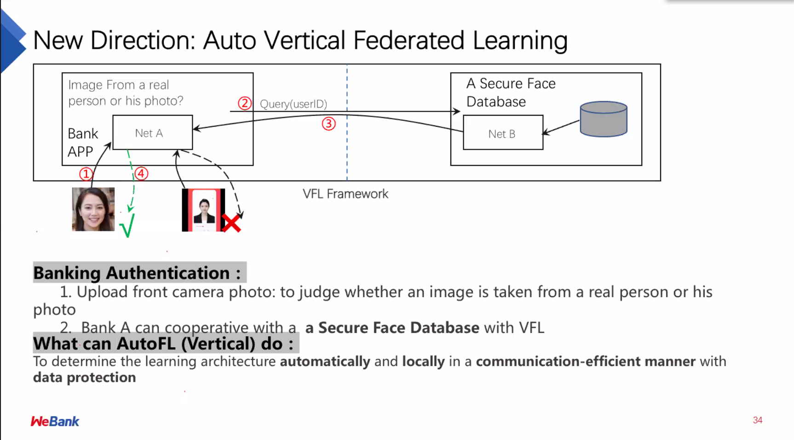
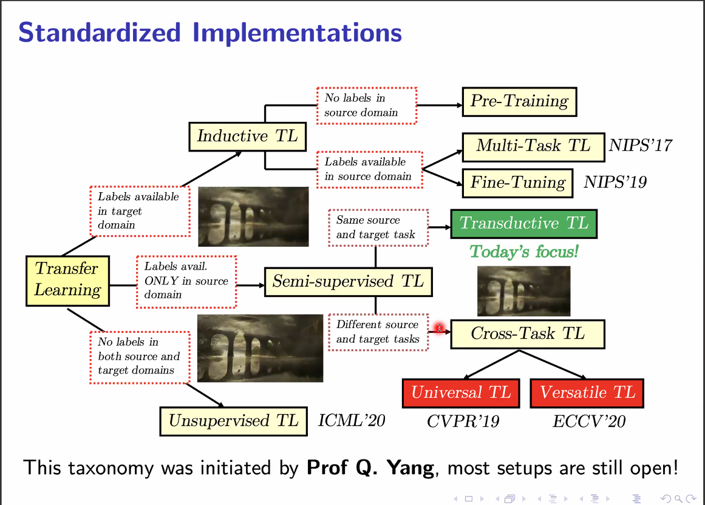

# FTL-IJCAI-2021

## 1. TimeTable

| **Time**      | **Activity**                                                 |
| ------------- | ------------------------------------------------------------ |
| 08:00 – 08:05 | **Openning Remarks**                                         |
| 08:05 – 09:00 | **Distinguished Keynote Lecture:** [A Journey from Transfer Learning to Federated Learning](http://federated-learning.org/fl-ijcai-2021/#k1), by Qiang Yang, Chief AI Officer (CAIO), WeBank / Chair Professor, Hong Kong University of Science and Technology (HKUST) |
| 09:00 – 09:20 | **Invited Talk 1:** [Federated Learning in Large Clinical Research Networks](http://federated-learning.org/fl-ijcai-2021/#k2), by Fei Wang, Cornell University |
| 09:20 – 09:40 | **Invited Talk 2:** [Towards Robust and Efficient Federated Learning](http://federated-learning.org/fl-ijcai-2021/#k3), by Shiqiang Wang, IBM T. J. Watson Research Center |
| 09:40 – 10:00 | **Invited Talk 3:** [How to Secure the Generalization of a Pre-trained Model](http://federated-learning.org/fl-ijcai-2021/#k4), by Ying Wei, City University of Hong Kong |
| 10:00 – 10:15 | **Break**                                                    |
| 10:15 – 11:00 | **Contributed Oral Presentation Session 1** (15 minutes per talk including Q&A)Alysa Ziying Tan, Han Yu, Lizhen Cui and Qiang Yang. [Towards Personalized Federated Learning](https://arxiv.org/abs/2103.00710)Ching Pui Wan and Qifeng Chen. [Robust Federated Learning with Attack-Adaptive Aggregation](http://federated-learning.org/fl-ijcai-2021/FTL-IJCAI21_paper_10.pdf)Mengmeng Tian, Yuxin Chen, Yuan Liu, Zehui Xiong, Cyril Leung and Chunyan Miao. [A Contract Theory based Incentive Mechanism for Federated Learning](http://arxiv.org/abs/2108.05568) |
| 11:00 – 11:20 | **Invited Talk 4:** [Label Leakage and Protection in Two-party Split Learning](http://federated-learning.org/fl-ijcai-2021/#k5), by Chong Wang, ByteDance |
| 11:20 – 11:40 | **Invited Talk 5:** [Federated Optimization under Real-world Constraints](http://federated-learning.org/fl-ijcai-2021/#k6), by Zheng Xu, Google |
| 11:40 – 12:00 | **Invited Talk 6:** [Large Scale Vertical Federated Learning](http://federated-learning.org/fl-ijcai-2021/#k7), by Liefeng Bo, JD |
| 12:00 – 13:00 | **Lunch Break**                                              |
| 13:00 – 14:00 | **Contributed Oral Presentation Session 2** (15 minutes per talk including Q&A)Lixin Fan, Bowen Li, Hanlin Gu, Yan Kang, Jie Li and Qiang Yang. [FedIPR: Ownership Verification for Federated Deep Neural Network Models](http://federated-learning.org/fl-ijcai-2021/FTL-IJCAI21_paper_21.pdf)Hao Li, Mingkai Huang, Bing Bai, Chang Wang, Kun Bai, Fei Wang, Xinghua Zhu, Binwen Zhao, Ganggang Liu and Chao Qi. [A Federated Multi-View Deep Learning Framework for Privacy-Preserving Recommendations](http://federated-learning.org/fl-ijcai-2021/FTL-IJCAI21_paper_7.pdf)Yan Kang, Yang Liu, Yuezhou Wu, Guoqiang Ma and Qiang Yang. [Privacy-preserving Federated Adversarial Domain adaptation over Feature Groups for Interpretability](http://federated-learning.org/fl-ijcai-2021/FTL-IJCAI21_paper_16.pdf)Cengguang Zhang, Junxue Zhang, Di Chai and Kai Chen. [Aegis: A Trusted, Automatic and Accurate Verification Framework for Vertical Federated Learning](http://federated-learning.org/fl-ijcai-2021/FTL-IJCAI21_paper_22.pdf) |
| 14:00 – 14:20 | **Invited Talk 7:** [Federated Learning for Industrial Video Recommendation](http://federated-learning.org/fl-ijcai-2021/#k8), by Hao Li, Tencent |
| 14:20 – 14:40 | **Invited Talk 8:** [Federated Continual and Semi-Supervised Learning](http://federated-learning.org/fl-ijcai-2021/#k9), by Sung Ju Hwang, Korea Advanced Institute of Science and Technology (KAIST) |
| 14:40 – 15:00 | **Invited Talk 9:** [Transfer Learning: Theory, Algorithms, and Open Library](http://federated-learning.org/fl-ijcai-2021/#k10), by Mingsheng Long, Tsinghua University |
| 15:00 – 16:00 | **Contributed Oral Presentation Session 3** (15 minutes per talk including Q&A)Hanlin Gu, Lixin Fan, Bowen Li, Yan Kang, Yuan Yao and Qiang Yang. [A novel approach to simultaneously improve privacy, efficiency and reliability of federated DNN learning](http://federated-learning.org/fl-ijcai-2021/FTL-IJCAI21_paper_31.pdf)Lingjuan Lyu and Chen Chen. [A Novel Attribute Reconstruction Attack in Federated Learning](http://federated-learning.org/fl-ijcai-2021/FTL-IJCAI21_paper_30.pdf)Xiaodian Cheng, Wanhang Lu, Xinyang Huang, Shuihai Hu and Kai Chen. [HAFLO: GPU-Based Acceleration for Federated Logistic Regression](https://arxiv.org/abs/2107.13797)Nhan Khanh Le, Yang Liu, Quang Minh Nguyen, Qingchen Liu, Fangzhou Liu, Quanwei Cai and Sandra Hirche. [FedXGBoost: Privacy-Preserving XGBoost for Federated Learning](http://federated-learning.org/fl-ijcai-2021/FTL-IJCAI21_paper_29.pdf) |
| 16:00 – 16:20 | **Invited Talk 10:** [Rethinking Importance Weighting for Transfer Learning](http://federated-learning.org/fl-ijcai-2021/#k11), by Masashi Sugiyama, The University of Tokyo |

## 2. 从迁移到联邦

？

## 3. FL in Large clinical research networks

## 4. LONG Mingsheng

IID -> OOD：

 

