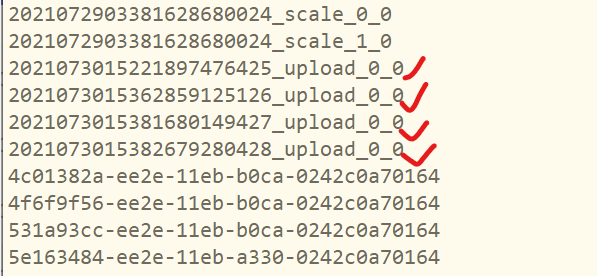
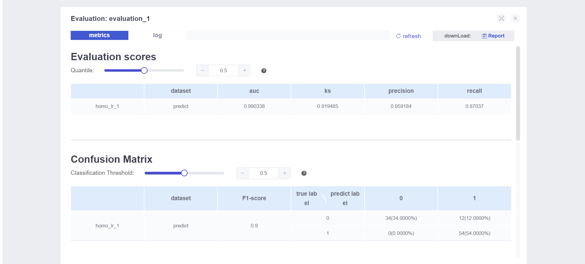
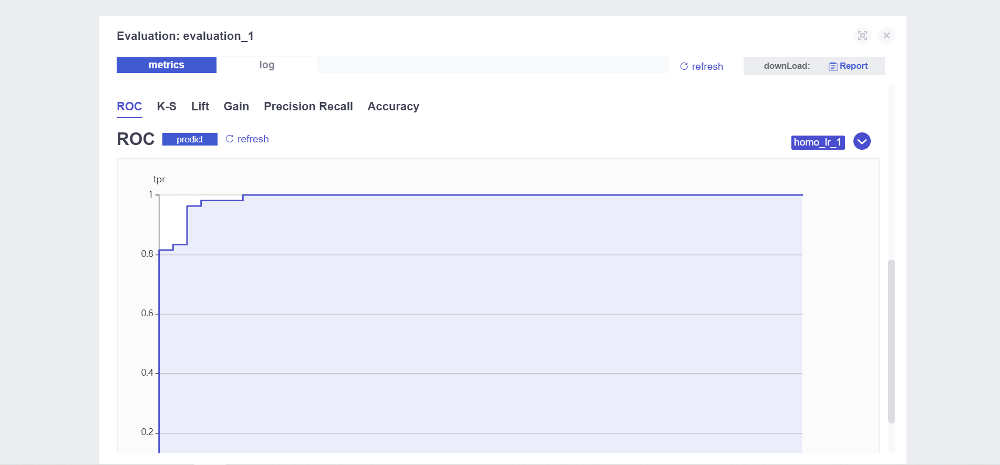

# 一、实验目的

1. 熟悉FATE训练的流程、基本操作命令

2. 熟悉横向逻辑回归的一般做法，联邦学习在其中的体现

 

# 二、数据集描述


- sklearn库中的乳腺癌肿瘤数据集
- 569个样本，每个样本数据有31列（30列特征数据，1列标签）。
- 30维特征包含10种属性，每个属性各以均值（mean）、标准差（std     error）、最差值（worst）出现3次
- 标签1表示良性肿瘤，标签0表示恶性肿瘤
- 569个样本中，标签1有357个，标签0有212个，近似均衡

 

# 三、横向逻辑回归整体架构

- 此问题是**二分类**，常用逻辑回归模型训练

- 逻辑回归：
$$
y=f(W^TX+b)
$$

其中 $f$ 为非线性映射函数/激活函数采用logisitic函数，$W、b$​为待训练参数

- 模拟**横向联邦建模**的场景，在本地将数据集切分为特征相同的横向联邦形式。

- FATE中的三方角色：Guest、Host、Arbiter

  - Guest表示数据应用方，在纵向算法中，Guest往往是有标签y的一方。
  - Host是数据提供方
  - 
    arbiter是用来辅助多方完成联合建模的，主要的作用是用来聚合梯度或者模型，比如纵向lr里面,各方将自己一半的梯度发送给arbiter，然后arbiter再联合优化等等，arbiter还参与以及分发公私钥，进行加解密服务等等。一般是由数据应用方Guest发起建模流程。

- 两个参与方A和B分别作为host和guest

- 取前469条样本为训练集，后100条为测试集

- 训练集划分：从469条训练样本中，选取前200条作为A方的本地数据，将剩余的269条数据作为B方的本地数据

- 测试集划分：测试数据集可以不需要切分，两个参与方使用相同的一份测试数据

 

# 四、横向联邦训练

## 1. **数据输入**

- FATE中数据格式为DTable，一种分布式的数据集合，可以理解为按参与方划分文件夹，独立存放各自的数据文件。

- 训练前要将本地数据集文件csv、txt等转换为DTable。

- FATE提供了转换工具，只要本地上传数据到指定目录、修改对应的配置文件、执行upload命令即可

### 1.1 [数据切分](https://github.com/FederatedAI/Practicing-Federated-Learning/blob/main/chapter05_FATE_HFL/split_dataset.py)

- 归一化：分别对每一列特征数据进行操作。==（疑点1）==
$$
y'=y-E[y]/std
$$

- 修改列名：==（疑点2）==

  - 改前

  

  - 改后

  

- 划分数据集：

  - 总样本数：569
  - 训练集：前469
    - 参与方A：前200
    - 参与方B：后269
  - 测试集：后100

- 保存数据到本地

  - 训练集：breast_1_train.csv，breast_2_train.csv

  - 测试集：breast_eval.csv

    

### 1.2 上传数据

cd到容器内存放数据的文件夹：/fate/examples/data


分三次上传这三个文件（一次性传可能出错）

`rz -be`

[rz参数解释](https://blog.csdn.net/sdujava2011/article/details/96476559)

-y 覆盖同名原文件


### 1.3 配置dsl和conf文件

cd到案例实验v1的横向逻辑回归项目文件夹：程度


标注的三个文件夹是用来上传csv文件的配置文件，为了上传我的自定义数据，重新新建4个json文件。每个文件的模板为：

```json
{
    "file": "/data/test.csv",
    "head": 1,
    "partition": 16,
    "work_mode": 0,
    "table_name": "test",
    "namespace": "experiment"
}
```

**字段说明：**

```
file: 文件路径
head: 指定数据文件是否包含表头
partition: 指定用于存储数据的分区数
work_mode: 指定工作模式，0代表单机版，1代表集群版
table_name: 本地文件转化为DTable的表名，自定义
namespace: DTable格式的表名对应的命名空间
```

新建的配置文件如下：


### 1.4 upload数据集并查看任务

在配置文件所在目录下执行4次**upload**命令，将本地文件转换成DTable格式：

`python /fate/python/fate_flow/fate_flow_client.py -f upload -c ${upload_data_json_path} `

例如执行upload_data_1_train.csv，命令行返回以下信息：


在浏览器中打开board_url:


在JOBS页面看到成功上传四个csv文件

cd到/fate/data目录，可以看到新增四个同名job名的文件夹



以及两个以namespace命名的文件夹


转化后的DTable数据就存放在这两个文件夹里


文件夹里对应两个参与方的数据，16个切片对应之前配置文件里定义的“partition”参数

==（疑问）==


官方git库里提供的数据集第一行数据很奇怪，打开jupyter看原始数据也是。不知道会不会在训练时出错

果然出错

用jupyter重新切分，重新上传 upload命令时，添加参数“-drop 1”，表示替换原来的数据


## 2. **模型训练**

- 组件化方式构建pipeline，通过自定义dsl和conf两个配置文件来实现。
  - dsl文件：用来描述任务模块，将任务模块以有向无环图（DAG）的形式组合在一起。
  - conf文件：设置各个组件的参数，比如输入模块的数据表名；算法模块的学习率、batch大小、迭代次数等。

### 2.1 修改配置文件

cd到案例实验v1的横向逻辑回归项目文件夹：/fate/examples/dsl/v1/homo_logistic_regression

修改这两个打勾的文件


- test_homolr_train_job_conf：描述任务模块，以有向无环图DAG形式组合
- test_homolr_train_job_dsl：设置各个组件的参数，如输入数据的表名、算法模块的学习率、batch大小、迭代次数等


### 2.2 使用submit_job命令执行模型训练

在配置文件所在目录下执行：

`python /fate/python/fate_flow/fate_flow_client.py -f submit_job -d ${dsl_json_path} -c ${conf_json_path}`

返回以下信息：


在fate_board中可以看到已上传的jobid：


==问题出现==：


dataio模块出错，猜想可能的原因：

1. 配置文件路径问题
2. 文件损坏、丢失
3. 文件格式错误，csv文件有不合法的行列

重新上传数据，得到正确的结果：


 

## 3. **模型评估**

- 采用留出法，用前面设置的测试集作为评估数据集。
- 测试集breast_eval.csv已经上传

 ### 3.1 修改配置文件


修改打勾的文件：（同名文件见本文档目录下）

test_homolr_evaluate_job_dsl.json
test_homolr_evaluate_job_conf.json

主要关注的点：

- dsl文件基本不变，主管pipeline设计
- conf文件注意role_parameters参数下：
  - guest参数下：args里面train_data&eval_data的name和namespace要和数据上传一致
  - host参数：同上

### 3.2 执行submit_job命令

`python /fate/python/fate_flow/fate_flow_client.py -f submit_job -d test_homolr_evaluate_job_dsl.json -c test_homolr_evaluate_job_conf.json `

### 3.3 Fate_board查看训练评估结果

看guest：







# 五、结果与思考

## 1. 抽象流程

上传数据–>upload–>配置dsl和conf（直接配带eval的版本）–>submit_job–>fateboard看结果

## 2. 待解决的问题

1. dsl配pipeline支持哪些模块、各有什么功能、怎么自建模块
2. conf配自建模块是否可行


**参考链接**

[官方教程](https://github.com/FederatedAI/Practicing-Federated-Learning/tree/main/chapter05_FATE_HFL)

[CSDN](https://blog.csdn.net/qq_41841524/article/details/117662143)

[本地](E:\Apps4Computer\typora\markdown_doc\联邦学习\实验\【实验1】FATE实现横向逻辑回归\【实验1】FATE实现横向逻辑回归.md)

