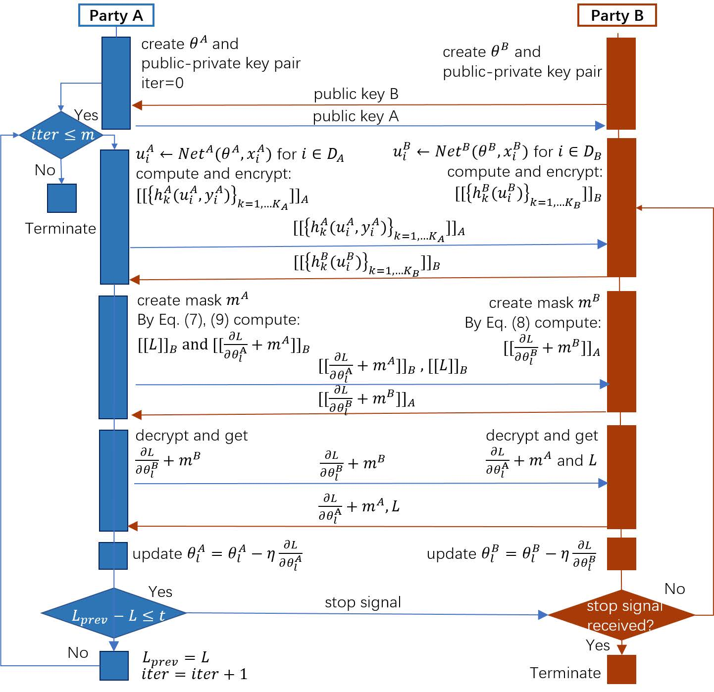

# [Secure Federated Transfer Learning](https://arxiv.org/abs/1812.03337)

（安全联邦迁移学习）

## 一、基本假设

### 1. FTL的一般场景

- A、B两方的两方联邦迁移学习系统
- 原始数据 $x_i^A\in R^a,x_j^B\in R^a$
- 标签 $y_i^A\in \{+1,-1\}$
- **源域** $D_A:=\{(x_i^A,y_i^A)\}_{i=1}^{N_A}$
- **目标域** $D_B:=\{x_j^B\}_{j=1}^{N_B}$
- $D_A,D_B$ 两个域互相孤立数据不能互通
- 存在一个大小有限的**重叠样本集** $D_{AB}:=\{(x_i^A,x_i^B)\}_{i=1}^{N_{AB}}$
- 存在一个位于A方但是针对B方的**标签数据集** $D_c:=\{(x_i^B,y_i^A)\}_{i=1}^{N_c}$
- 所有标签都位于A方（或B方）
- 使用基于加密的技术可以在保护隐私的同时匹配到A、B两方具有相同ID的样本，即重叠样本集可以获得
- **任务目标**：两方各自持有数据不共享的前提下，为目标域B预测标签

### 2. 安全的定义

- 假设每一方都是**诚实且好奇**的，会尝试从收到的数据中推测尽量多的信息。
- 考虑一个有半诚实敌对方的威胁模型，该敌对方最多可以破坏联邦迁移学习系统中的一方。
- 对于一个协议$P$，有 $(O_A,O_B)=P(I_A,I_B)$ ，$O$表示输出，$I$表示输入。若存在无穷多个 $(I_B^{'},O_B^{'})$ 对，使得 $(O_A,O_B^{'})=P(I_A,I_B^{'}))$ ，则说明$P$对A方是安全的

## 二、FTL框架

- FTL基本框架：基于深度神经网络，原始数据先经过**特征提取网络**得到**隐藏表征**，再输入到**预测函数**得到标签
  - **特征提取网络 **用于生成A、B两方的隐藏表征，记作 $Net^A,Net^B$。
  - **隐藏表征**  $u_i^A=Net^A(x_i^A),u_i^B=Net^B(x_i^B)$，其中 $u^A\in R^{N_A\times d},u^B\in R^{N_B\times d}$ ，$d$ 表示隐藏表征的维度，$N$ 表示样本数量。
  - **预测函数** 用于根据B方隐藏表征计算得到标签，A方自带标签故不用计算。表达式为 $\varphi(u_j^B)=\varphi(u^A,y^A,u_j^B)$ 。[参考文献](https://dl.acm.org/doi/abs/10.1145/2733373.2806216) 使用了一种转换函数 $\varphi(u_j^B)=\frac{1}{N_A}\sum_i^{N_A}y_i^Au_i^A{(u_j^B)}^{'}$，其中 $^{'}$ 表示转置。该函数是**线性可分**的，又可以记作 $\varphi(u_j^B)=\Phi^A\mathcal{G}(u_j^B)$

- 最终训练的损失函数由三部分组成：
  - $\mathcal{L}_{1}$ ：表示**预测标签值与真实标签值之间的误差**，因此此部分计算只能使用数据集 $D_c$ 。损失函数 $\ell_{1}$ 可以是Logistic损失，$\ell_{1}(y,\varphi)=log(1+e^{-y\varphi})$ 。文中采用的损失为**==二阶泰勒近似==**的Logistics损失，即 $\ell_{1}(y, \varphi) \approx \ell_{1}(y, 0)+\frac{1}{2} C(y) \varphi+\frac{1}{8} D(y) \varphi^{2}$ ， 相应的梯度为 $\frac{\partial \ell_{1}}{\partial \varphi}=\frac{1}{2} C(y)+\frac{1}{4} D(y) \varphi$，其中 $C(y)=-y,D(y)=y^2$
  - $\mathcal{L}_{2}$ ：表示A、B两方的**对齐损失**。期望两方的隐藏表征可以非常相似，使用重叠数据集 $D_{AB}$ 。$\ell_{2}$可以是距离度量函数，表示为 $-u_i^A(u_j^B)^{'}$ 或 $\lVert u_i^A-u_j^B\rVert _F^2$ ，其中 $\lVert \cdot\rVert _F^2$ 表示Frobenius范数的平方。文中使用的表示为 $\ell_{2}(u_i^A,u_i^B)=\ell_{2}^A(u_i^A)+ \ell_{2}^B(u_i^B)+ \kappa u_i^A(u_i^B)^{'}$，$\kappa$ 为常数
  - $\mathcal{L}_{3}$ ：**正则化参数**。？？？ 

$$
\mathcal{L}_{1}=\sum_{i=1}^{N_{c}} \ell_{1}\left(y_{i}^{A}, \varphi\left(u_{i}^{B}\right)\right)
$$

$$
\mathcal{L}_{2}=\sum_{i=1}^{N_{A B}} \ell_{2}\left(u_{i}^{A}, u_{i}^{B}\right)
$$

$$
\mathcal{L}_{3}^{A}=\sum_{l}^{L_{A}}\left\|\theta_{l}^{A}\right\|_{F}^{2},
\mathcal{L}_{3}^{B}=\sum_{l}^{L_{B}}\left\|\theta_{l}^{B}\right\|_{F}^{2}
$$

- 整体训练的**目标函数**即最小化损失函数。${\Theta^{A}, \Theta^{B}}$ 分别为 $Net^A,Net^B$ 的训练参数，设 $L_A$ 和 $L_B$ 为 $Net$ 的层数，则 $\Theta^{A}=\left\{\theta_{l}^{A}\right\}_{l=1}^{L_{A}}$，$\Theta^{B}=\left\{\theta_{l}^{B}\right\}_{l=1}^{L_{B}}$，其中 $\theta_{l}^{A}$，$\theta_{l}^{B}$ 为第 $l$ 层的训练参数。$\gamma$ 和 $\lambda$ 为权重参数。

$$
\underset{\Theta^{A}, \Theta^{B}}{\operatorname{argmin}} \mathcal{L}=\mathcal{L}_{1}+\gamma \mathcal{L}_{2}+\frac{\lambda}{2}\left(\mathcal{L}_{3}^{A}+\mathcal{L}_{3}^{B}\right)
$$

- 反向传播更新${\Theta^{A}, \Theta^{B}}$ 的**梯度**：$i\in \{A,B\}$

$$
\frac{\partial \mathcal{L}}{\partial \theta_{l}^{i}}=\frac{\partial \mathcal{L}_{1}}{\partial \theta_{l}^{i}}+\gamma \frac{\partial \mathcal{L}_{2}}{\partial \theta_{l}^{i}}+\lambda \theta_{l}^{i}
$$

- 目标函数和梯度的计算需要保证隐私保护，上述两个公式的计算将在A、B两方的联合下进行。下文提出两种方案：一是基于同态加密，二是基于秘密共享。

## 三、 FTL+加法同态加密（AHE）

### 1. 引入AHE

引入加法同态加密算子 $[[\cdot]]$ ，损失函数和梯度的表达式更新为：
$$
\begin{align}
[[\mathcal{L}]] & = \sum_{i}^{N_{c}}\left(\left[\left[\ell_{1}\left(y_{i}^{A}, 0\right)\right]\right]+\frac{1}{2} C\left(y_{i}^{A}\right) \Phi^{A}\left[\left[\mathcal{G}\left(u_{i}^{B}\right)\right]\right]\right.\\
&\left.+\frac{1}{8} D\left(y_{i}^{A}\right) \Phi^{A}\left[\left[\left(\mathcal{G}\left(u_{i}^{B}\right)\right)^{\prime} \mathcal{G}\left(u_{i}^{B}\right)\right]\right]\left(\Phi^{A}\right)^{\prime}\right) \\
&+\gamma \sum_{i}^{N_{A B}}\left(\left[\left[\ell_{2}^{B}\left(u_{i}^{B}\right)\right]\right]+\left[\left[\ell_{2}^{A}\left(u_{i}^{A}\right)\right]\right]+\kappa u_{i}^{A}\left[\left[\left(u_{i}^{B}\right)^{\prime}\right]\right]\right) \\
&+\left[\left[\frac{\lambda}{2} \mathcal{L}_{3}^{A}\right]\right]+\left[\left[\frac{\lambda}{2} \mathcal{L}_{3}^{B}\right]\right]
\end{align}
$$

$$
\begin{aligned}
\left[\left[\frac{\partial \mathcal{L}}{\partial \theta_{l}^{B}}\right]\right] &=\sum_{i}^{N_{c}} \frac{\partial\left(\mathcal{G}\left(u_{i}^{B}\right)\right)^{\prime} \mathcal{G}\left(u_{i}^{B}\right)}{\partial u_{i}^{B}}\bigg[\bigg[\frac{1}{8} D\left(y_{i}^{A}\right)\left(\Phi^{A}\right)^{\prime} \Phi^{A}\bigg]\bigg] \frac{\partial u_{i}^{B}}{\partial \theta_{l}^{B}}\\
&+\sum_{i}^{N_{c}}\left[\left[\frac{1}{2} C\left(y_{i}^{A}\right) \Phi^{A}\right]\right] \frac{\partial \mathcal{G}\left(u_{i}^{B}\right)}{\partial u_{i}^{B}} \frac{\partial u_{i}^{B}}{\partial \theta_{l}^{B}} \\
&+\sum_{i}^{N_{A B}}\left(\left[\left[\gamma \kappa u_{i}^{A}\right]\right] \frac{\partial u_{i}^{B}}{\partial \theta_{l}^{B}}+\left[\left[\gamma \frac{\partial \ell_{2}^{B}\left(u_{i}^{B}\right)}{\partial \theta_{l}^{B}}\right]\right]\right)+\left[\left[\lambda \theta_{l}^{B}\right]\right]
\end{aligned}
$$

$$
\begin{aligned}
\left[\left[\frac{\partial \mathcal{L}}{\partial \theta_{l}^{A}}\right]\right] &=\sum_{j}^{N_{A}} \sum_{i}^{N_{c}}\left(\frac{1}{4} D\left(y_{i}^{A}\right) \Phi^{A}\left[\left[\mathcal{G}\left(u_{i}^{B}\right)^{\prime} \mathcal{G}\left(u_{i}^{B}\right)\right]\right]\right.\\
&\left.+\frac{1}{2} C\left(y_{i}^{A}\right)\left[\left[\mathcal{G}\left(u_{i}^{B}\right)\right]\right]\right) \frac{\partial \Phi^{A}}{\partial u_{j}^{A}} \frac{\partial u_{j}^{A}}{\partial \theta_{l}^{A}} \\
&+\gamma \sum_{i}^{N_{AB} }\left(\left[\left[\kappa u_{i}^{B}\right]\right] \frac{\partial u_{i}^{A}}{\partial \theta_{l}^{A}}+\left[\left[\frac{\partial \ell_{2}^{A}\left(u_{i}^{A}\right)}{\partial \theta_{l}^{A}}\right]\right]\right)+\left[\left[\lambda \theta_{l}^{A}\right]\right]
\end{aligned}
$$

### 2. 训练流程

设 $[[\cdot]]_A,[[\cdot]]_B$ 表示带有公共密钥的同态加密运算符。

1. A、B初始化各自的神经网络 $Net$

2. A计算并加密一组中间结果 $\left\{h_{k}^A\left(u_{i}^{A}, y_{i}^{A}\right)\right\}_{k=1,2 \ldots K_{A}}$ 并发送给B以辅助其计算梯度和损失，这里 $K_A=3$ ，表达式如下。同理 B也要计算并加密一组中间结果 $\left\{h_{k}^B\left(u_{i}^{B}\right)\right\}_{k=1,2 \ldots K_{B}}$ 给A ，这里 $K_B=4$ 。这一步是并行的。

$$
h_{1}^A\left(u_{i}^{A}, y_{i}^{A}\right)=\bigg\{  \bigg[\bigg[\frac{1}{8} D\left(y_{i}^{A}\right)\left(\Phi^{A}\right)^{\prime} \Phi^{A}\bigg]\bigg]_A\bigg\}_{i=1}^{N_c}
$$

$$
h_{2}^A\left(u_{i}^{A}, y_{i}^{A}\right)=\bigg\{  \bigg[\bigg[\frac{1}{2} C\left(y_{i}^{A}\right)\Phi^{A}\bigg]\bigg]_A\bigg\}_{i=1}^{N_c}
$$

$$
h_{3}^A\left(u_{i}^{A}, y_{i}^{A}\right)=\big\{  \big[\big[\gamma \kappa u_{i}^{A}\big]\big]_A\big\}_{i=1}^{N_{AB}}
$$

$$
h_{1}^{B}\left(u_{i}^{B}\right)=\left\{\left[\left[\left(\mathcal{G}\left(u_{i}^{B}\right)\right)^{\prime} \mathcal{G}\left(u_{i}^{B}\right)\right]\right]_{B}\right\}_{i=1}^{N_{c}}
$$

$$
h_{2}^{B}\left(u_{i}^{B}\right)=\left\{\left[\left[ \mathcal{G}\left(u_{i}^{B}\right)\right]\right]_{B}\right\}_{i=1}^{N_{c}}
$$

$$
h_{3}^B\left(u_{i}^{B}\right)=\big\{  \big[\big[\kappa u_{i}^{B}\big]\big]_B\big\}_{i=1}^{N_{AB}}
$$

$$
h_{4}^B\left(u_{i}^{B}\right)=  \big[\big[ \frac{\lambda}{2} \mathcal{L}_{3}^{B}  \big]\big]_B
$$

3. A方基于接收到的中间结果，计算得到损失 $[[\mathcal{L}]]_B$ 和梯度 $\left[\left[\frac{\partial \mathcal{L}}{\partial \theta_{l}^{A}}\right]\right]_B $ ，之后创建随机掩码 $m^A$ 并添加至梯度得到 $\left[\left[\frac{\partial \mathcal{L}}{\partial \theta_{l}^{A}}+m^A\right]\right]_B $ 。A将计算得到的这两个与B相关的结果发给B。同理B也会基于上一步接收的关于A的中间结果计算得到梯度 $\left[\left[\frac{\partial \mathcal{L}}{\partial \theta_{l}^{B}}\right]\right]_A $ （B方不会计算损失），并创建随机掩码 $m^B$ 添加进梯度，得到 $\left[\left[\frac{\partial \mathcal{L}}{\partial \theta_{l}^{B}}+m^B\right]\right]_A $ 并发送给A。这一步也是并行的。
4. A方解密得到 $\frac{\partial \mathcal{L}}{\partial \theta_{l}^{B}}+m^B$ 并发送给B，B方解密得到 $\frac{\partial \mathcal{L}}{\partial \theta_{l}^{A}}+m^A$ 和总损失 $\mathcal{L}$ 并发送给A。这一步并行。
5. A、B两方各自去掉掩码，分别得到各自的梯度，更新各自的模型。
6. A方在每一轮的训练过程中监测 $\mathcal{L}$，一旦发现损失收敛，即向B发送终止训练的信号，否则前往第一步继续。

### 3. 预测流程

对于每一条B方为标注的样本，执行以下预测流程：

1. B方使用已训练好的网络 $Net^B$ 计算 $u_j^B$ ，再加密成 $[[u_j^B]]$ 发给A。
2. A方使用预测函数 $\varphi(u_j^B)=\Phi^A\mathcal{G}(u_j^B)$ 评估 $[[u_j^B]]$ ，并用随机值对结果进行掩藏得到 $\left[\left[\varphi(u_j^B)+m^A\right]\right]_B $ 发给B。
3. B解密并将结果 $\varphi(u_j^B)+m^A$ 发给A。
4. A去掉掩码得到 $\varphi(u_j^B)$ ，通过在真实标签域中比较得到 $y_j^B$ ，并将标签发给B。

### 4. 安全性分析

- 在双方都是“诚实且好奇”的前提下，只要底层的AHE是安全的，则FTL的训练以及预测过程都是安全的。
- 训练过程中：
  - 未公开数据：双方的原始数据、本地模型
  - 交换的AHE加密信息：隐藏表征
  - 交换的未加密数据：模型参数的梯度信息，但是引入了掩藏机制，双方只知道被掩藏了的对方模型梯度信息
- 预测过程中：
  - A接收被加密的隐藏表征，返回预测标签结果，无法反推B的信息
  - B只接收标签结果，无法反推A的信息

- 漏洞和问题
  - B要预测标签必须依赖A，即A知道B的所有标签，这是否也是一种隐私泄露？比如A医院知道B医院所有患有癌症患者的数量，（不满足差分隐私？）
  - B一旦利用A获取一定数量的标签后，是否可以舍弃A然后在自己的数据集上训练？
  - 不满足“诚实且好奇”的“恶意方”出现，如A在输入上作假只提供一个非零输入，也许可以在输入的位置上推断 $u_i^B$ 的值（但任然无法获取原始数据和模型参数），这样一来双方都无法得到正确的结果

## 四、 FTL+秘密共享（SS）

- 和上面的方法保持一致，使用二阶泰勒近似，损失和梯度表达式为：

$$
\begin{aligned}
\mathcal{L} &=\sum_{i}^{N_{C}} \bigg(\ell_{1}\left(y_{i}^{A}, 0\right)+\frac{1}{2} C\left(y_{i}^{A}\right) \Phi^{A} \mathcal{G}\left(u_{i}^{B}\right) \\
&+\left(\frac{1}{8} D\left(y_{i}^{A}\right) \Phi^{A} \mathcal{G}\left(u_{i}^{B}\right)\right)\left(\Phi^{A} \mathcal{G}\left(u_{i}^{B}\right)\right)\bigg) \\
&+\gamma \sum_{i}^{N_{A B}}\left(\ell_{2}^{B}\left(u_{i}^{B}\right)+\ell_{2}^{A}\left(u_{i}^{A}\right)+\kappa u_{i}^{A}\left(u_{i}^{B}\right)^{\prime}\right) \\
&+\frac{\lambda}{2}\left(\mathcal{L}_{3}^{A}+\mathcal{L}_{3}^{B}\right)
\end{aligned}
$$

$$
\begin{aligned}
\frac{\partial \mathcal{L}}{\partial \theta_{\ell}^{B}} &=\sum_{i}^{N_{C}} \bigg(\frac{1}{2} C\left(y_{i}^{A}\right) \Phi^{A} \frac{\partial \mathcal{G}\left(u_{i}^{B}\right)}{\partial \theta_{\ell}^{B}} \\
&+2\left[\left(\frac{1}{8} D\left(y_{1}^{A}\right) \Phi^{A} \mathcal{G}\left(u_{i}^{B}\right)\right)\left(\Phi^{A} \frac{\partial\left(\mathcal{G}\left(u_{i}^{B}\right)\right)}{\partial \theta_{\ell}^{B}}\right)\right]\bigg) \\
&+\sum_{i}^{N_{A B}}\left(\gamma \kappa u_{i}^{A} \frac{\partial u_{i}^{B}}{\partial \theta_{\ell}^{B}}+\gamma \frac{\partial \ell_{2}^{B}\left(u_{i}^{B}\right)}{\partial \theta_{\ell}^{B}}\right)+\lambda \theta_{\ell}^{B}
\end{aligned}
$$

$$
\begin{aligned}
\frac{\partial \mathcal{L}}{\partial \theta_{l}^{A}} &=\sum_{i}^{N_{C}}\bigg( \frac{1}{2} C\left(y_{i}^{A}\right) \frac{\partial \Phi^{A}}{\partial \theta_{\ell}^{A}} \mathcal{G}\left(u_{i}^{B}\right) \\
&+2\left[\left(\frac{1}{8} D\left(y_{i}^{A}\right) \Phi^{A} \mathcal{G}\left(u_{i}^{B}\right)\right)\left(\frac{\partial \Phi^{A}}{\partial \theta_{\ell}^{A}} \mathcal{G}\left(u_{i}^{B}\right)\right)\right]\bigg) \\
&+\gamma \sum_{i}^{N_{A B}}\left(\kappa u_{i}^{B} \frac{\partial u_{i}^{A}}{\partial \theta_{\ell}^{A}}+\frac{\partial \ell_{2}^{A}\left(u_{i}^{A}\right)}{\partial \theta_{\ell}^{A}}\right)+\lambda \theta_{\ell}^{A}
\end{aligned}
$$

- 假设任意一个隐私值由两方共享，即 $v=\langle v\rangle_{A}+\langle v\rangle_{B}$ ，A、B分别持有 $\langle v\rangle_{A},\langle v\rangle_{B}$ 
- SS方法也需要满足“同态性”，需要构建安全的矩阵加法和乘法，其中加法的构建比较简单无需两方之间额外的通信，而乘法的构建则需要引入三元组(Beaver Triples)辅助计算。

### 1. 使用三元组进行安全矩阵乘法

- 假设现在需要计算 $P=MN$ ，其中 $M,N,P$ 的维度分别为 $m\times n,n\times k,m\times k$
- $M,N$ 是隐私值且分别由A、B持有。A将 $M$ 秘密地分成 $\langle M\rangle_{A},\langle M\rangle_{B}$ 并将 $\langle M\rangle_{B}$ 发给B，B同理操作 $N$。最终使得A持有 $\langle M\rangle_{A}\&\langle N\rangle_{A}$ ，B持有$\langle M\rangle_{B}\&\langle N\rangle_{B}$ 进行下一步计算
- 假设A、B已经通过**某种方式（见2）**生成了三元组 $D,E,F$ ，维度分别为 $m\times n,n\times k,m\times k$ ，满足 $DE=F$ 。且A持有 $\langle D\rangle_{A}\&\langle E\rangle_{A}\&\langle F\rangle_{A}$ ，B持有$\langle D\rangle_{B}\&\langle E\rangle_{B}\&\langle F\rangle_{B}$ 

- 实现安全矩阵乘法的算法是：

  1. A方计算 $\langle \delta\rangle_{A}=\langle M\rangle_{A}-\langle D\rangle_{A},\langle \gamma\rangle_{A}=\langle N\rangle_{A}-\langle E\rangle_{A}$ ，并发送给B方。同时，B方计算 $\langle \delta\rangle_{B}=\langle M\rangle_{B}-\langle D\rangle_{B},\langle \gamma\rangle_{B}=\langle N\rangle_{B}-\langle E\rangle_{B}$ ，并发送给A方。
  2. A、B还原隐私值 $\delta=\langle \delta\rangle_{A}+\langle \delta\rangle_{B}, \gamma=\langle \gamma\rangle_{A}+\langle \gamma\rangle_{B}$
  3. A方计算 $\langle P\rangle_{A}=\langle M\rangle_{A}\gamma+\delta\langle N\rangle_{A}+\langle F\rangle_{A}$，B方计算 $\langle P\rangle_{B}=\langle M\rangle_{B}\gamma+\delta\langle N\rangle_{B}+\langle F\rangle_{B}-\delta\gamma$ 。两者互相交换公开计算结果

  这样 $P=\langle P\rangle_{A}+\langle P\rangle_{B}=MN$ ，A、B双方在保密各自的M、N的情况下计算得到M、N的乘积。这里需要注意的是，A不能通过 $M$ 和 $P$ 还原得到 $N$ ，即无法求矩阵 $M$ 的逆，所以 $M$ 不能是方阵，B同理。==（这一块是个人理解，文中作者没讲不能是方阵，此处插个眼）==

### 2. 三元组的生成

- A、B两方提前知道 $D,E$ 的维度 $m\times n,n\times k$ ，三元组的生成算法为：

  1. A随机生成两个数 $\langle D\rangle_{A},\langle E\rangle_{A}$ ，同时B随机生成两个数 $\langle D\rangle_{B},\langle E\rangle_{B}$
  2. 通过**离线安全矩阵乘法（见3）** 计算得到 $W=\langle D\rangle_{A}\langle E\rangle_{B}$ ，$Z=\langle D\rangle_{B}\langle E\rangle_{A}$ ，且A持有 $\langle W\rangle_{A},\langle Z\rangle_{A}$ ，B持有 $\langle W\rangle_{B},\langle Z\rangle_{B}$
  3. A本地计算得到 $\langle F\rangle_{A}=\langle D\rangle_{A}\langle E\rangle_{A}+\langle W\rangle_{A}+\langle Z\rangle_{A}$ 
  4. B本地计算得到 $\langle F\rangle_{B}=\langle D\rangle_{B}\langle E\rangle_{B}+\langle W\rangle_{B}+\langle Z\rangle_{B}$ 

  最终A持有 $\langle D\rangle_{A}\&\langle E\rangle_{A}\&\langle F\rangle_{A}$ ，B持有$\langle D\rangle_{B}\&\langle E\rangle_{B}\&\langle F\rangle_{B}$ ，完成三元组生成的目的

### 3. 离线安全矩阵乘法

- 需要借助第三方的力量，假设为C，且公平公正不公开

- 假设两个矩阵 $U,V$ ，分别A、B持有，计算其乘积的算法是：

  1. 引入第三方C
  2. A随机生成 $\langle U\rangle_{0}$ ，并计算 $\langle U\rangle_{1}=U-\langle U\rangle_{0}$ ，然后把 $\langle U\rangle_{0}$ 发给C，$\langle U\rangle_{1}$ 发给B
  3. B随机生成 $\langle V\rangle_{0}$ ，并计算 $\langle V\rangle_{1}=V-\langle V\rangle_{0}$ ，然后把 $\langle U\rangle_{0}$ 发给A，$\langle U\rangle_{1}$ 发给C
  4. C计算 $\tilde{W}=\langle U\rangle_{0}\langle V\rangle_{1}$ ，随机生成 $\langle \tilde{W}\rangle_{A}$ ，并计算 $\langle \tilde{W}\rangle_{B}=\tilde{W}-\langle \tilde{W}\rangle_{A}$ ，然后把 $\langle \tilde{W}\rangle_{A}$ 发给A，$\langle \tilde{W}\rangle_{B}$ 发给B
  5. A计算 $\langle {W}\rangle_{A}=\langle U\rangle_{0}\langle V\rangle_{0}+\langle U\rangle_{1}\langle V\rangle_{0}+\langle \tilde{W}\rangle_{A}$ 
  6. B计算 $\langle {W}\rangle_{B}=\langle U\rangle_{1}\langle V\rangle_{1}+\langle \tilde{W}\rangle_{B}$

  最终 $W=\langle {W}\rangle_{A}+\langle {W}\rangle_{B}=UV$ 

- 思考：“套娃”？为什么不直接用离线安全矩阵乘法的算法计算，而是先用它计算三元组再计算乘法？A、B需要保护的是$M、N$，为此它们生成了随机矩阵$D、E$，并掺入第三方C来协助计算$F$，得到三元组，这样一来第三方只知道无关紧要的三元组信息，而A、B计算$P=MN$的时候不再需要第三方，而是利用各自持有的$D、E、F$。妙啊~

### 4. 基于SS方法的FTL训练过程

公式表达太多，基本思想就是将式子中有关A和B的项拆分开来，于是只有加法和乘法两种基本运算，使用上面的SS三元组方法即可。

### 5. 基于SS方法的FTL预测过程

这部分与AHE方法类似
